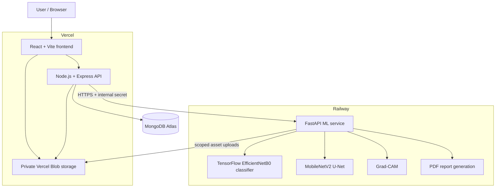

# EyeZen

## Explainable AI for Diabetic Retinopathy Screening

EyeZen is an explainable, AI-assisted diabetic retinopathy (DR) screening decision-support prototype. A clinician can upload a retinal fundus image, receive a five-class DR severity estimate and referral-oriented screening output, review visual explanations, download a report, and revisit securely scoped screening records.

> EyeZen is a screening decision-support research prototype. It does not provide a confirmed medical diagnosis and should not replace evaluation by a qualified ophthalmologist or healthcare professional.

    

## Problem statement

Diabetes can damage the small blood vessels of the retina, leading to diabetic retinopathy. Early disease may progress without obvious symptoms, so timely retinal screening is important. In rural and underserved settings, however, access to specialists can be limited.

EyeZen helps organize a screening workflow and prioritize images that may need specialist review. It is designed to support—not replace—clinical judgement.

## Our solution

EyeZen turns a retinal image into an interpretable screening record:

```text
Retinal image → secure upload → AI analysis → DR grade + probabilities
→ referable-DR probability → lesion localization + Grad-CAM
→ REFER / NON-REFER recommendation → PDF report → screening history
```

Rather than returning one opaque label, the system presents severity, calibrated screening risk, class probabilities, a lesion-localization overlay, and classifier-attention visualization. This makes the output easier to inspect and discuss during screening review.

## Key features

- Account registration and JWT-authenticated access.
- JPG/PNG retinal fundus-image screening (up to 12 MB).
- Five-class DR grading: No DR, Mild, Moderate, Severe, and Proliferative DR.
- Calibrated referable-DR probability and `REFER` / `NON_REFER` recommendation.
- U-Net lesion-localization overlay and Grad-CAM classifier-attention image.
- Generated PDF screening report.
- User-scoped screening history with patient-name, age, and record-ID filters.
- Private Vercel Blob storage with short-lived signed asset URLs in the production storage path.

## Screening output

| Grade | Meaning |
| --- | --- |
| 0 | No DR |
| 1 | Mild DR |
| 2 | Moderate DR |
| 3 | Severe DR |
| 4 | Proliferative DR |

For the grade-derived component, **referable DR** means Grade 2, 3, or 4. A completed screening can include the predicted grade, grade confidence, five grade probabilities, calibrated referable-DR probability, referral threshold, `REFER` / `NON_REFER` decision, U-Net overlay, Grad-CAM image, and a downloadable report.

The decision is screening-oriented; it is not a confirmed diagnosis.

## System architecture



- **React/Vite** provides authentication, screening submission, results, and history views.
- **Express** authenticates requests, enforces record ownership, orchestrates Blob access, calls the ML service, and persists results.
- **MongoDB Atlas** stores users and screening records.
- **Private Vercel Blob** stores retinal inputs, visualizations, and reports in the deployed storage mode.
- **FastAPI on Railway** loads the TensorFlow models once at startup and performs inference and report generation.

## End-to-end pipeline

```mermaid
flowchart LR
    A[Sign in] --> B[Enter patient details]
    B --> C[Select JPG or PNG fundus image]
    C --> D[Browser uploads private image to Blob]
    D --> E[Express validates user and Blob path]
    E --> F[FastAPI /infer]
    F --> G[Decode, crop border, and preprocess]
    G --> H[EfficientNetB0 grade + binary screening heads]
    H --> I[Calibration and referral decision]
    I --> J[U-Net lesion localization]
    J --> K[Grad-CAM attention]
    K --> L[Create PDF and generated images]
    L --> M[Store generated assets privately]
    M --> N[Store screening record in MongoDB]
    N --> O[Display result and retain it in history]
```



## Technology stack

| Category | Technologies verified in this repository |
| --- | --- |
| Frontend | React 18, Vite, React Router, CSS |
| API backend | Node.js, Express, Axios, Multer |
| ML backend | Python 3.11 container, FastAPI, Uvicorn |
| Machine learning | TensorFlow/Keras, EfficientNetB0, MobileNetV2 U-Net, Grad-CAM |
| Image processing | Pillow, NumPy, OpenCV |
| Database | MongoDB, Mongoose |
| Authentication | JWT (`jsonwebtoken`), bcryptjs |
| Storage | Private Vercel Blob with signed access URLs |
| Reports | ReportLab |
| Deployment configuration | Vercel and Railway |

## Machine learning

### DR classifier

The V4 classifier is a transfer-learning **EfficientNetB0** model with a 300 × 300 RGB input. Transfer learning starts from visual features learned on ImageNet and adapts them for retinal images.

It has two outputs:

1. A five-class DR-grading head.
2. A binary referable-DR screening head.

The two signals are combined and calibrated for the referral-oriented output rather than relying on one raw confidence value.

### Training datasets

| Dataset | Role in this project |
| --- | --- |
| APTOS 2019 Blindness Detection | DR grading; train/validation and held-out internal test split |
| EyePACS | Additional DR-grading images for multi-domain training |
| DDR | Additional DR-grading images for multi-domain training |
| IDRiD | Lesion annotations for U-Net lesion localization |
| Messidor-2 | Untouched external evaluation only |

The V4 classifier uses APTOS + EyePACS + DDR for multi-domain training. The configured sampling targets were 6,000 EyePACS images and 3,500 DDR images; the recorded training run used 5,400 EyePACS, 3,150 DDR, and 2,563 APTOS images, with 600, 350, and 549 validation images respectively. Messidor-2 was not used for training, calibration, threshold selection, or model selection.

### Training configuration

| Setting | V4 configuration |
| --- | --- |
| Classifier input | 300 × 300 RGB |
| Batch size | 24 with GPU; 6 CPU fallback |
| Stage 1 maximum | 3 epochs |
| Stage 2 maximum | 6 epochs |
| Fine-tuned EfficientNet layers | 45 |
| Head learning rate | 5e-4 |
| Fine-tuning learning rate | 1.5e-5 |
| Weight decay | 1e-4 |
| Screening-sensitivity target | 0.90 |
| Target class proportions (0–4) | 30%, 15%, 25%, 15%, 15% |

The training notebook includes data augmentation, class weighting, two-stage transfer learning, early stopping, learning-rate reduction, and model selection using QWK plus referable-DR AUC. Mixed precision is enabled when a GPU is available. Epoch counts above are configured maxima, not a claim that every run necessarily completed every epoch.

### Data splitting

- **APTOS:** stratified 70% training, then the remaining 30% is split equally into 15% validation and 15% held-out test.
- **EyePACS and DDR:** training/validation separation at approximately 90%/10%, with grouping logic used to reduce leakage where supported.
- **Messidor-2:** 100% held out for external evaluation.

Separate training, validation, and test data helps prevent overly optimistic estimates caused by evaluating a model on images that influenced its development.

### Calibration and referral decision

EyeZen temperature-scales grade probabilities, calculates grade-derived referable probability as P(Grade 2–4), combines it with the dedicated binary screening head, applies Platt calibration, and compares the resulting probability with a validation-selected threshold. The stored decision rule selects a threshold satisfying at least 90% validation sensitivity and then maximizes specificity.

This approach makes the referral probability more useful for a sensitivity-oriented screening workflow. Calibration values and internal secrets are intentionally not reproduced here.

## Model evaluation

### V4 APTOS held-out test (n = 550)

| Metric | Result |
| --- | ---: |
| Five-class accuracy | 74.00% |
| Quadratic weighted kappa (QWK) | 0.8534 |
| Referable-DR AUC | 0.9656 |
| Sensitivity | 95.96% |
| Specificity | 84.10% |

### Messidor-2 untouched external test (n = 1,744)

| Metric | Result |
| --- | ---: |
| Five-class accuracy | 62.44% |
| Quadratic weighted kappa (QWK) | 0.5638 |
| Referable-DR AUC | 0.8117 |
| Sensitivity | 68.49% |
| Specificity | 80.11% |

Accuracy is the overall proportion of correct grades. QWK accounts for the ordered nature of grades, so confusing Grade 3 with Grade 4 is penalized less than confusing Grade 0 with Grade 4. AUC summarizes separation between referable and non-referable cases. Sensitivity measures how often potentially referable cases are detected; specificity measures how often non-referable cases are not unnecessarily referred.

External performance is lower because retinal datasets vary in cameras, image acquisition, demographics, image quality, and labeling. Reporting untouched external evaluation is a strength: it exposes domain shift honestly instead of hiding it.

### Important metric interpretation

Sensitivity matters in screening because missing a patient who may need specialist review can be harmful; specificity helps reduce unnecessary referrals. QWK is especially useful because DR grades are ordered, and external testing shows how performance changes beyond the development data.

## Lesion localization — U-Net

EyeZen uses a U-Net-style model with a **MobileNetV2 encoder** and decoder for lesion localization. It is trained from IDRiD lesion annotations using 384 × 384 input and predicts a binary union of DR-related lesion regions: microaneurysms, hemorrhages, hard exudates, and soft exudates. The optic disc is not treated as a lesion.

| IDRiD validation measure | Result |
| --- | ---: |
| Dice | 0.5435 |
| IoU | 0.3732 |
| Segmentation threshold | 0.85 |

Dice and IoU measure overlap between predicted and annotated lesion regions; larger values indicate more overlap. U-Net is EyeZen’s primary lesion-localization explanation.

## Grad-CAM

Grad-CAM highlights retinal regions that influenced the classifier’s referable-DR decision.

| Output | What it represents |
| --- | --- |
| U-Net | Where lesion-like regions are localized |
| Grad-CAM | Where the classifier focused while making its screening decision |

Grad-CAM is an attention visualization, **not** precise lesion segmentation or a causal explanation.

## Application components

### Frontend

The React/Vite application includes registration and login, a screening dashboard, patient details and image upload, detailed screening results, visual explanations, report download, and history filters for patient name, age, and record ID. It communicates with Express through REST APIs.

### Node / Express backend

Express handles authentication, request validation, screening ownership, MongoDB operations, private Blob URL orchestration, and calls to FastAPI. JWTs are issued after registration or login, passwords are hashed with bcryptjs, and screening queries are scoped to the authenticated user.

### FastAPI ML backend

The separate FastAPI service loads the classifier, U-Net, calibration, and deployment artifacts during startup. It fetches or receives the input image, preprocesses it, performs classifier and U-Net inference, creates Grad-CAM and PDF outputs, and returns a canonical inference result. Its available endpoints are `GET /health` and protected `POST /infer`.

Express sends the internal service secret with inference requests; the secret itself is never exposed to the browser or documented as a value.

### Database

MongoDB/Mongoose stores:

- **User:** name, email, password hash, and timestamps.
- **Screening:** owner reference, patient name/record ID/age, local or Blob image references, generated-asset Blob paths, inference result, and timestamps.

The production flow stores Blob pathnames and creates temporary URLs when an authorized user needs an asset, rather than persisting permanent public image URLs.

### Private image storage

In the Vercel Blob storage mode, the retinal input, U-Net overlay, Grad-CAM image, and PDF are private. The API creates time-limited signed URLs and validates user ownership before granting asset access. The ML service receives scoped URLs for the individual inference job; it does not require the Blob read/write token.

## Deployment architecture

- **Vercel:** React/Vite frontend, Node/Express API entry point, and Blob integration.
- **Railway:** containerized FastAPI service, TensorFlow, U-Net, Grad-CAM, and PDF generation.
- **MongoDB Atlas:** production database.

TensorFlow and model artifacts are substantially larger than typical serverless-function packages, so the ML service is containerized and deployed independently on Railway. This repository contains deployment configuration; it does not by itself verify a currently live deployment.

## Project structure

```text
EyeZen/
├── api/                    # Vercel Node entry point
├── client/                 # React/Vite frontend
│   └── src/
├── server/                 # Express API, routes, middleware, models
│   └── src/
├── ml-service/             # FastAPI inference service and ML artifacts
│   ├── artifacts/
│   ├── app.py
│   ├── model_adapter.py
│   ├── requirements.txt
│   └── Dockerfile
├── DEPLOYMENT.md
├── package.json
├── vercel.json
└── README.md
```

## Local development setup

### Prerequisites

- Node.js and npm (a current LTS release is recommended).
- Python 3.11, matching the ML Docker image.
- A MongoDB instance (local MongoDB or MongoDB Atlas).
- The tracked V4 model artifacts under `ml-service/artifacts/` for real inference.

### 1. Clone and install

```bash
git clone https://github.com/Shaurya-XD/diabetic_retinopathy.git
cd diabetic_retinopathy
npm install
npm run install:all
```

### 2. Configure environment files

Copy the supplied examples and replace placeholder values with your own development configuration.

```powershell
Copy-Item server/.env.example server/.env
Copy-Item client/.env.example client/.env
```

For local ML inference, set matching `INTERNAL_ML_SECRET` values in `server/.env` and the shell that starts FastAPI. Use `DEMO_MODE=false` only when the required artifacts are available and compatible.

### 3. Install and start the ML service

```powershell
python -m venv .venv
.venv\Scripts\Activate.ps1
pip install -r ml-service/requirements.txt
$env:DEMO_MODE='false'
$env:INTERNAL_ML_SECRET='your-local-secret'
python -m uvicorn app:app --app-dir ml-service --reload --port 8000
```

### 4. Start the frontend and Express API

In a second terminal from the repository root:

```bash
npm run dev
```

The Vite client runs at `http://localhost:5173`; the Express API defaults to port 5000 and the ML service above uses port 8000.

For detailed Vercel + Railway deployment guidance, see [DEPLOYMENT.md](DEPLOYMENT.md).

## Environment variables

| Variable | Used by | Purpose |
| --- | --- | --- |
| `PORT` | Express | Local API listen port (default 5000) |
| `MONGODB_URI` | Express | MongoDB connection URI |
| `JWT_SECRET` | Express | JWT signing secret |
| `ML_SERVICE_URL` | Express | FastAPI inference-service base URL |
| `INTERNAL_ML_SECRET` | Express and FastAPI | Shared server-to-server inference authorization secret |
| `CLIENT_ORIGIN` | Express | Allowed client origin for CORS |
| `VITE_API_URL` | React/Vite | Local API base URL |
| `DEMO_MODE` | FastAPI | Explicitly enables deterministic demo responses when `true` |
| `ALLOW_UNAUTHENTICATED_LOCAL_INFER` | FastAPI | Explicit local-development-only inference bypass |
| `BLOB_READ_WRITE_TOKEN` | Express/Vercel | Production private Blob integration |
| `STORAGE_MODE` | Express | Selects storage behavior; `vercel-blob` enables Blob flow |
| `ARTIFACTS_DIR` | FastAPI | Optional model-artifact directory override |
| `OUTPUT_DIR` | FastAPI | Optional local runtime-output directory override |

Never commit `.env` files, credentials, tokens, or secrets.

## API overview

| Group | Endpoints |
| --- | --- |
| API health | `GET /api/health` |
| Authentication | `POST /api/auth/register`, `POST /api/auth/login` |
| Blob access | `POST /api/blob/upload-intent`, `GET /api/blob/screenings/:id/:asset` |
| Screenings | `GET /api/screenings`, `GET /api/screenings/dashboard`, `GET /api/screenings/:id`, `POST /api/screenings` |
| ML service | `GET /health`, protected `POST /infer` |

## Security and privacy

- JWT authentication and bcrypt password hashing.
- Authenticated, user-scoped screening queries and asset access.
- Input file-type and size validation.
- Private Blob objects with temporary signed access URLs in the production path.
- A shared internal secret for Express-to-FastAPI inference requests.
- Environment-based configuration for credentials and deployment values.

EyeZen does not claim HIPAA/GDPR certification, medical regulatory approval, or clinical certification.

## Why EyeZen is explainable AI

| Output | Purpose |
| --- | --- |
| DR grade | Severity estimate across five ordered classes |
| Referable probability | Referral-oriented screening risk |
| U-Net | Lesion-like region localization |
| Grad-CAM | Classifier attention visualization |
| PDF report | A portable, interpretable screening summary |

Together these outputs provide more context than a single predicted label.

## Key strengths of our implementation

- Multi-domain classification training using APTOS, EyePACS, and DDR.
- Untouched Messidor-2 external evaluation.
- A referral-oriented output alongside five-class grading.
- Complementary explainability: U-Net lesion localization and Grad-CAM attention.
- Cloud-oriented workflow with persistent screening history.
- Private medical-image storage design and user-specific record access.
- Modular React, Express, FastAPI, and TensorFlow architecture.
- Relevance to rural and underserved screening workflows where specialist review may be scarce.

## Limitations

- Performance changes across datasets; external-domain generalization remains imperfect.
- Grade 1 and minority grades can be difficult to classify reliably.
- Retinal-image quality can affect predictions.
- U-Net localization is not a substitute for expert lesion annotation.
- Grad-CAM is attention visualization, not a causal or precise segmentation method.
- This prototype has not undergone prospective clinical validation.
- Clinical decisions must remain with qualified healthcare professionals.

## Future scope

- Larger multi-center datasets and stronger domain adaptation.
- Image-quality assessment and rejection before inference.
- Better rare-grade handling and lesion segmentation.
- Additional retinal-disease screening models.
- Multilingual and rural workflow support.
- Offline or edge inference.
- Integration with screening centers and tele-ophthalmology workflows.
- Prospective clinical validation.

## Demo workflow

1. Register or sign in.
2. Open the screening dashboard.
3. Enter patient name, record ID, and optional age.
4. Upload a JPG or PNG fundus image.
5. Run the explainable screening.
6. Review grade, confidence, probabilities, and referral recommendation.
7. Inspect the U-Net lesion-localization and Grad-CAM visualizations.
8. Download the screening report.
9. Reopen or filter the saved record from screening history.

## Team contribution areas

- Machine Learning / Deep Learning
- Frontend
- Node.js / Express Backend
- FastAPI / ML Integration
- Database & Authentication
- Cloud Deployment & Storage
- Testing & Documentation

## Acknowledgements and datasets

This project uses or evaluates against the following datasets; ownership remains with their respective creators and providers:

- APTOS 2019 Blindness Detection
- EyePACS
- DDR
- IDRiD
- Messidor-2

## License

License information has not yet been specified.
